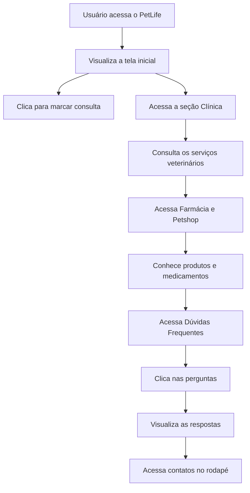

# PetLife — Clínica Veterinária e Petshop

<p align="center">
  
</p>

<p align="center">
  
  
  
  
  
</p>

<p align="center">
  Landing page para apresentação de uma clínica veterinária, petshop e farmácia voltada ao cuidado completo dos pets.
</p>

---

## Sobre o Projeto

O **PetLife** é um projeto web desenvolvido com **HTML5**, **CSS3** e **JavaScript**, criado para apresentar uma clínica veterinária fictícia com serviços voltados ao cuidado, saúde e bem-estar dos animais de estimação.

A página possui uma estrutura de landing page com seções de apresentação, clínica, farmácia, petshop, dúvidas frequentes e canais de contato.

O projeto tem como objetivo praticar conceitos de desenvolvimento web, organização de conteúdo em seções, estilização visual com CSS, navegação por âncoras e interatividade com JavaScript na área de perguntas frequentes.

---

## Preview do Projeto

### Tela Inicial

<p align="center">
  
</p>

A tela inicial apresenta a proposta da PetLife, com uma chamada para garantir uma vida longa e feliz para os pets, além de botões para marcar consulta e conhecer a clínica.

---

### Clínica Veterinária

<p align="center">
  
</p>

Essa seção apresenta os serviços veterinários oferecidos pela clínica, como consultas, vacinação, cirurgias, odontologia veterinária, controle de doenças e atendimento de emergência.

---

### Petshop e Farmácia

<p align="center">
  
</p>

A seção de petshop e farmácia apresenta produtos, medicamentos, acessórios, alimentos, brinquedos e cuidados recomendados para os animais de estimação.

---

### Dúvidas Frequentes

<p align="center">
  
</p>

A área de dúvidas frequentes possui perguntas interativas, que podem ser abertas e fechadas com JavaScript.

---

## Objetivo do Projeto

O objetivo do **PetLife** é criar uma landing page informativa e visual para uma clínica veterinária e petshop.

Com esse projeto, é possível praticar:

* estruturação de páginas com HTML;
* criação de landing pages;
* organização de conteúdo por seções;
* navegação por links internos;
* estilização com CSS;
* uso de imagens SVG;
* criação de botões;
* uso de flexbox;
* criação de FAQ interativo;
* manipulação de classes com JavaScript;
* criação de rodapé com links e contatos.

---

## Funcionalidades

* Página inicial com apresentação da PetLife.
* Menu de navegação com links internos.
* Botão para marcar consulta via WhatsApp.
* Botão para conhecer a clínica.
* Seção sobre cuidados veterinários.
* Lista de serviços oferecidos pela clínica.
* Seção de petshop e farmácia.
* Área de dúvidas frequentes interativa.
* Rodapé com links rápidos.
* Informações de contato.
* Link direto para WhatsApp.
* Link direto para envio de e-mail.
* Imagens ilustrativas em SVG.
* Interação de abrir e fechar perguntas com JavaScript.

---

## Serviços Apresentados

A seção de clínica apresenta os seguintes serviços:

* Consultas de rotina e exames de saúde abrangentes.
* Vacinação e imunização.
* Cirurgias e procedimentos veterinários.
* Tratamento e controle de doenças.
* Odontologia veterinária.
* Atendimento de emergência 24 horas.
* Nutrição e aconselhamento alimentar personalizado.

---

## Tecnologias Utilizadas

| Tecnologia    | Finalidade                         |
| ------------- | ---------------------------------- |
| HTML5         | Estrutura da página                |
| CSS3          | Estilização e layout               |
| JavaScript    | Interatividade da seção de dúvidas |
| SVG           | Imagens, logo e ícones do projeto  |
| WhatsApp Link | Agendamento de consulta            |
| Mailto        | Contato por e-mail                 |

---

## Estrutura do Projeto

```text
PetLife/
│
├── index.html
├── style.css
├── app.js
├── README.md
│
└── img/
    ├── arrow-down.svg
    ├── clinic-img.svg
    ├── faq-img.svg
    ├── logo-white.svg
    ├── logo.svg
    ├── shape.svg
    ├── shop-img.svg
    └── start-img.svg
```

---

## Descrição dos Principais Arquivos

### `index.html`

Arquivo principal do projeto.

Ele contém toda a estrutura da landing page, incluindo:

* cabeçalho;
* logo;
* menu de navegação;
* seção inicial;
* seção da clínica;
* seção de farmácia e petshop;
* seção de dúvidas frequentes;
* rodapé;
* links de contato;
* importação do arquivo JavaScript.

---

### `style.css`

Arquivo responsável pela estilização da página.

Nele estão definidos:

* reset básico de margem e padding;
* fonte padrão;
* cores principais;
* layout do cabeçalho;
* estilização dos botões;
* posicionamento das imagens;
* estilização das seções;
* uso de flexbox;
* estilização da área de dúvidas;
* estilo do rodapé;
* área de copyright.

---

### `app.js`

Arquivo JavaScript responsável pela interatividade da seção de dúvidas frequentes.

O script seleciona todos os elementos com a classe `.duvida` e adiciona um evento de clique para abrir ou fechar a resposta da pergunta selecionada.

Exemplo da lógica utilizada:

```javascript
const elementosDuvida = document.querySelectorAll(".duvida")

elementosDuvida.forEach(function(duvida) {
    duvida.addEventListener('click', function () {
        duvida.classList.toggle('ativa')
    })
});
```

---

### `img/`

Pasta responsável por armazenar as imagens e ícones utilizados no projeto.

Ela contém a logo, ilustrações das seções, ícone de seta e elementos visuais decorativos.

---

## Seções da Página

### Início

Apresenta a chamada principal do projeto:

```text
Garanta uma vida longa e cheia de alegria para o seu melhor amigo
```

Também possui dois botões:

* **Marque uma consulta**
* **Conheça nossa clínica**

---

### Clínica

Apresenta os cuidados veterinários de qualidade oferecidos pela PetLife.

A seção destaca a atuação da clínica, seus profissionais e os principais serviços para saúde e bem-estar dos pets.

---

### Farmácia e Petshop

Apresenta o petshop e a farmácia da PetLife.

Essa seção destaca produtos como:

* alimentos balanceados;
* petiscos;
* brinquedos;
* acessórios;
* medicamentos;
* suplementos;
* produtos de cuidado.

---

### Dúvidas Frequentes

Área interativa com perguntas e respostas.

As perguntas presentes no projeto são:

* Quais serviços são oferecidos pela clínica da PetLife?
* Quais espécies de animais a clínica veterinária atende?
* A clínica da PetLife possui serviços de emergência?
* A clínica oferece serviços de banho e tosa?

---

### Rodapé

O rodapé apresenta:

* logo da PetLife;
* frase institucional;
* links rápidos;
* WhatsApp;
* e-mail;
* endereço;
* crédito do desenvolvedor.

---

## Como Executar o Projeto

Por ser um projeto feito apenas com **HTML**, **CSS** e **JavaScript**, não é necessário instalar dependências.

### 1. Clone o repositório

```bash
git clone https://github.com/seu-usuario/PetLife.Matheus686.git
```

---

### 2. Acesse a pasta do projeto

```bash
cd PetLife.Matheus686
```

---

### 3. Abra o projeto no navegador

Você pode abrir diretamente o arquivo:

```text
index.html
```

Ou usar a extensão **Live Server** no VS Code.

Com o Live Server:

1. Abra a pasta do projeto no VS Code.
2. Clique com o botão direito no arquivo `index.html`.
3. Selecione **Open with Live Server**.
4. O projeto será aberto no navegador.

---

## Fluxo da Página



---

## Exemplo de Uso

Um usuário acessa o **PetLife** para conhecer uma clínica veterinária.

Na página inicial, ele visualiza a proposta da clínica, acessa a seção de serviços veterinários, consulta informações sobre petshop e farmácia, tira dúvidas na área de perguntas frequentes e utiliza o botão de WhatsApp para marcar uma consulta.

---

## Possíveis Melhorias Futuras

Algumas melhorias que podem ser implementadas futuramente:

* Tornar o layout totalmente responsivo para celular.
* Adicionar menu mobile.
* Corrigir pequenos ajustes ortográficos nos textos.
* Melhorar textos alternativos das imagens.
* Adicionar formulário de contato.
* Adicionar mapa com localização da clínica.
* Criar botão fixo de WhatsApp.
* Adicionar animações suaves nas seções.
* Adicionar seção de depoimentos de clientes.
* Adicionar cards para os serviços.
* Criar página individual para cada serviço.
* Melhorar acessibilidade da área de FAQ.
* Adicionar modo claro e modo escuro.
* Publicar o projeto no GitHub Pages.

---

## Sugestão de Responsividade

Para melhorar a visualização em telas menores, pode ser adicionada uma media query no CSS:

```css
@media (max-width: 768px) {
  header {
    flex-direction: column;
    padding: 24px;
    gap: 16px;
  }

  header nav {
    display: flex;
    flex-direction: column;
    text-align: center;
  }

  header nav a {
    padding: 12px;
  }

  #inicio,
  #clinica,
  #duvidas,
  footer {
    flex-direction: column;
    padding: 32px 24px;
  }

  #inicio img,
  #clinica img,
  #farmacia img,
  #duvidas img {
    width: 100%;
    height: auto;
  }

  #farmacia {
    padding: 32px 24px;
  }
}
```

---

## Observações Importantes

* O projeto não possui backend ou banco de dados.
* O arquivo principal é o `index.html`.
* A estilização está concentrada no arquivo `style.css`.
* A interatividade das dúvidas está no arquivo `app.js`.
* As imagens utilizadas estão armazenadas na pasta `img`.
* O botão de consulta direciona para o WhatsApp.
* O e-mail de contato utiliza link `mailto`.
* Para melhor experiência durante o desenvolvimento, recomenda-se usar o Live Server no VS Code.

---

## Deploy no GitHub Pages

Para publicar o projeto no GitHub Pages:

1. Envie o projeto para um repositório no GitHub.
2. Acesse o repositório.
3. Vá em **Settings**.
4. Clique em **Pages**.
5. Em **Branch**, selecione `main`.
6. Em seguida, selecione a pasta `/root`.
7. Clique em **Save**.
8. Aguarde o GitHub gerar o link do site.

Depois disso, o projeto poderá ser acessado publicamente pelo navegador.

---

## Autor

Projeto desenvolvido por **Matheus Soares** para fins acadêmicos e de aprendizado, com foco em desenvolvimento web, HTML, CSS, JavaScript, criação de landing pages, organização de conteúdo por seções, interatividade com perguntas frequentes e apresentação de serviços veterinários.

---

## Licença

Este projeto é de uso acadêmico e educacional.
